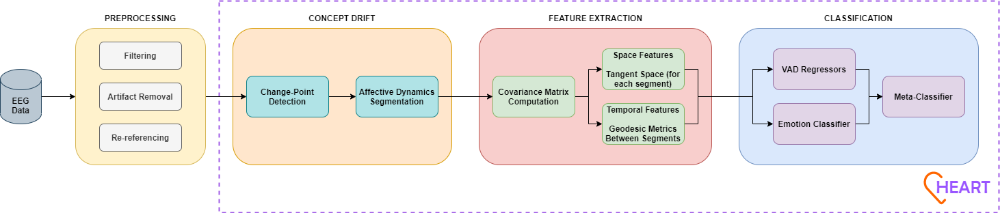
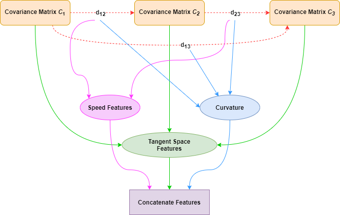

# HEART: Hybrid Embedding for Affective and Riemannian Trajectories

## Overview

HEART is a Python framework for emotion recognition from EEG signals. It integrates spatial, temporal, and affective dynamics using:

- Concept drift-inspired dynamic segmentation to model within-trial emotional changes
- Riemannian geometry for feature extraction (tangent-space embeddings and geodesic trajectories)
- Hybrid meta-classification combining continuous Valence-Arousal-Dominance (VAD) regression and categorical emotion classification

The framework has been evaluated on FACED, SEED-VII, and SEED EEG datasets, demonstrating robust performance across subjects and sessions.

## Features

1. Preprocessing

- Band-pass filtering (0.05–47 Hz)
- Artifact removal via ICA
- Common average re-referencing
- Segmentation into manageable epochs

2. Dynamic Segmentation

- Concept drift-based change-point detection within EEG trials
- Generates data-adaptive segments capturing emotional transitions

3. Feature Extraction

- Tangent-space embeddings from covariance matrices
- Pairwise geodesic distances between segments
- Transition speed and curvature along trajectories
- Hybrid spatial-temporal feature vectors per trial

4. Classification

- Random Forest regressors for continuous VAD prediction
- Random Forest classifier for categorical emotion labels
- Meta-classifier fuses continuous and categorical outputs

## Datasets

HEART was evaluated on the following EEG datasets:

- <a href="https://www.synapse.org/Synapse:syn50614194/wiki/620378" target="_blank" rel="noopener noreferrer">FACED</a>: 32-channel EEG from 123 participants across 9 emotion categories
- <a href="https://bcmi.sjtu.edu.cn/home/seed/seed-vii.html" target="_blank" rel="noopener noreferrer">SEED-VII</a>: 62-channel EEG from 20 participants with 7 emotions, including continuous intensity labels
- <a href="https://bcmi.sjtu.edu.cn/home/seed/seed.html" target="_blank" rel="noopener noreferrer">SEED</a>: 62-channel EEG from 15 participants across 3 emotion categories

Note: These datasets are not included due to access restrictions. Researchers must request access from the respective dataset owners. Synthetic example data is provided for running the notebooks without the real datasets.

## License

This repository is licensed under GPL v3. The code is intended for non-commercial research use. Users must cite the corresponding paper:

Jonah Fernandez, Bianca Innocenti, Beatriz López. HEART: Hybrid Embedding for Affective and Riemannian Trajectories. November 2025, Preprint available at TechRxiv, doi: 10.36227/techrxiv.176413322.21496678/v1.
